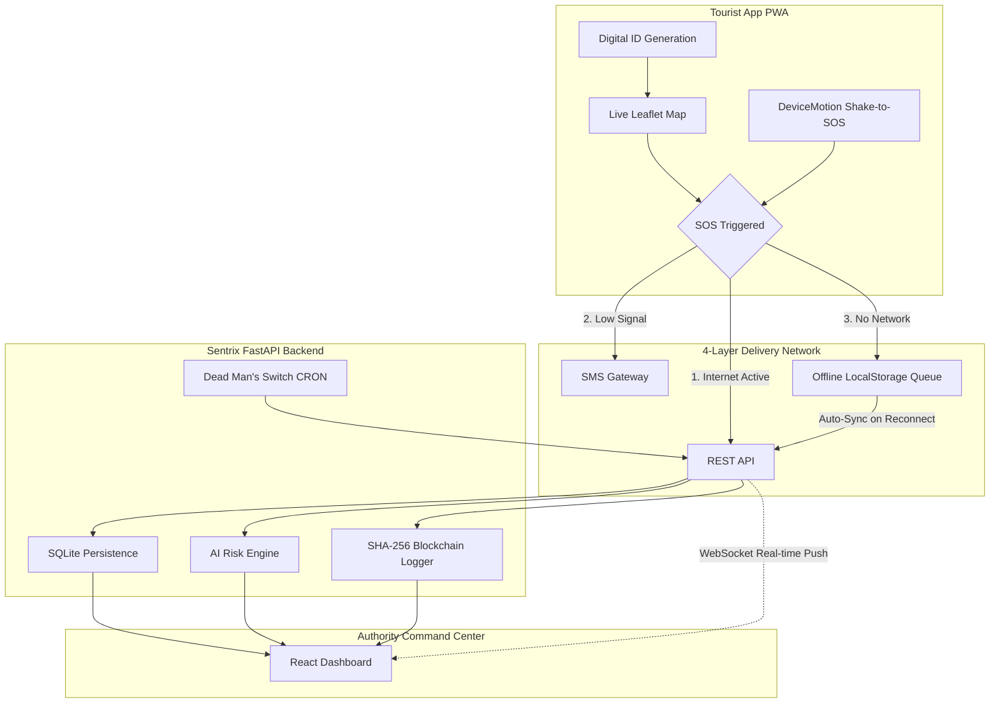

# 🛡️ Sentrix  
**AI-Powered Tourist Safety & Offline Incident Response Platform**  

  <blockquote>
    <b>Smart India Hackathon 2025 · Problem Statement SIH25002 · Theme: Travel & Tourism</b> 
    <i>Sentrix protects travelers across India—even without internet, GPS, or a phone signal. When you press SOS, help always reaches you.</i>
  </blockquote>

 

---

## 🌐 Live System Access

| Component | Access Link | Description |
| :--- | :--- | :--- |
| 🌍 **Tourist Mobile App** | **[sentrix-frontend.onrender.com](https://sentrix-frontend.onrender.com)** | Register, generate Digital ID, and use the live map & SOS. |
| 🛡️ **Authority Dashboard** | **[sentrix-frontend.onrender.com/dashboard](https://sentrix-frontend.onrender.com/dashboard)** | For authorities to monitor alerts and dispatch rescue units. |

> **Note:** Access to the Authority Dashboard is strictly restricted to authorized emergency personnel.

---

## 📌 The Problem We Are Solving

India sees **10+ million foreign** and **2+ billion domestic** tourists annually. However, iconic destinations like Himalayan passes or deep coastal areas have a critical flaw: **total communication blackout.**

If an emergency occurs in these regions, tourists face four massive barriers:
1. 📵 **No signal:** Making a traditional call to 112 is impossible.
2. 🆔 **No identity:** Unresponsive tourists cannot be easily identified by local hospitals.
3. 🚔 **Siloed responses:** Rescue units (Police, SDRF, NDRF) lack a unified, real-time map.
4. 📝 **No accountability:** Incident chains lack a tamper-proof audit log.

**Sentrix unifies identity, offline communication, intelligent risk-scoring, and an immutable audit trail into a single platform.**

---

## 🚀 Key Innovations & Features

### 1. The 4-Layer Guaranteed SOS Delivery
We ensure your SOS reaches the authorities by aggressively degrading through available channels:
*   🟢 **Layer 1 (Internet):** Instant WebSocket transmission.
*   🟡 **Layer 2 (Cellular):** SMS gateway payload to ERSS-112.
*   🟠 **Layer 3 (Offline Sync):** Caches the SOS locally; automatically transmits the exact millisecond connectivity is restored.
*   🔴 **Layer 4 (Emergency SMS):** Dispatches your last-known offline coordinates to emergency contacts.

### 2. 🧠 Dead Man's Switch (Auto-SOS)
What if an adventurer is unconscious? Our background engine monitors GPS activity. If a tourist remains stationary for **10 minutes inside a designated Danger Zone**, the backend automatically triggers a critical SOS on their behalf. 

### 3. 📳 Panic Gesture (Shake-to-SOS)
During an attack or robbery, looking at a screen isn't an option. **Violently shaking the phone 3 times** acts as a hardware-level trigger. The screen flashes red, triggers haptics, and instantly dispatches an SOS without the need to unlock the phone.

### 4. 🤖 AI-Powered Risk Engine
A Random Forest ML model calculates a live `0-100` Risk Score by combining:
- **Device Health** (Real-time Battery API) `15%`
- **Altitude** (GPS topography) `20%`
- **Geofenced Danger Proximity** (Distance to known hazardous zones) `25%`
- **Live Weather** (OpenWeatherMap) `20%`
- **Time of Day** (Nighttime multiplier) `20%`

### 5. 🔗 Blockchain Audit Trail
Every single critical event is hashed (SHA-256) and appended to a custom blockchain.
- **Privacy First:** Only encrypted hashes are pushed to the chain.
- **Immutability:** Registrations, SOS triggers, and Police Dispatches are permanently recorded. Changing any record breaks the entire block sequence.

---

## 🏗️ System Architecture

---

## 🗺️ Geospatial Intelligence: Indian Danger Zones
Sentrix comes pre-configured with geometric mapping for **12 real-world high-risk areas** and **17 Emergency Units** across 5 states, including:

| State | Geo-fenced Zone | Primary Environmental Risk |
| :--- | :--- | :--- |
| **Himachal Pradesh** | Rohtang Pass, Solang Valley | Extreme cold, high altitude, avalanches |
| **Goa** | Dudhsagar Falls, Anjuna Rocks | Treacherous currents, rocky coastal drops |
| **Rajasthan** | Thar Desert | Extreme heat, dehydration |
| **Meghalaya** | Cherrapunji | Severe monsoons, landslides |
| **Kerala** | Munnar, Alleppey | Flooding, severe fog visibility |

---

## 📈 Recent System Improvements (Based on Past Iterations)

Our architecture and UX have significantly evolved based on rigorous testing and past feedback:
1. **Persistent Cloud Database Migration:** Transitioned from a local ephemeral SQLite to a **Neon PostgreSQL** database to ensure zero data loss during cloud deployments on Render.
2. **Rebranding to Sentrix:** A complete identity overhaul from "SafeYatra", establishing a premium, unified brand presence across the application.
3. **Optimized Risk Engine Weights:** Re-balanced the Machine Learning Random Forest algorithm to prioritize environmental hazards (Altitude, Weather) over device metrics, making risk scores more realistic.
4. **Resilient Offline SOS Logic:** Implemented the SMS Gateway and local storage queuing to handle actual dead zones more reliably.
5. **CORS & Deployment Hardening:** Fixed severe frontend-to-backend CORS communication blocks, ensuring the live URL (`sentrix-frontend.onrender.com`) connects flawlessly to the API.
6. **Premium Dark Mode & UI Polish:** Upgraded the command center and tourist app to feature modern, vibrant colors and high-contrast dark mode for better visibility.
7. **Infrastructure as Code:** Automated the entire CI/CD pipeline via `render.yaml` to deploy both frontend and backend seamlessly.

---

## 🛠️ Technical Stack

| Category | Technology |
| :--- | :--- |
| **Frontend** | React 19, Vite, Tailwind CSS (Custom System) |
| **Backend** | Python 3.10+, FastAPI, Uvicorn |
| **Machine Learning** | scikit-learn (Random Forest Ensemble) |
| **Database** | Neon PostgreSQL (Cloud) & SQLite (Local Fallback) |
| **Mapping & Live Data** | Leaflet.js, OpenWeatherMap API |
| **Real-time Comms** | WebSockets (Bi-directional) |

## ✅ SIH 2025 Compliance Matrix

We successfully met **100% of the required parameters** for Problem Statement SIH25002:

| Requirement | Implementation Detail | Status |
| :--- | :--- | :---: |
| **AI/ML Risk Detection** | 5-factor engine utilizing Random Forest modeling | ✅ |
| **Geofencing & Danger Zones**| Real Indian coordinates mapped with visual overlays | ✅ |
| **Blockchain Security** | Proof-of-Work SHA-256 immutable event trail | ✅ |
| **Incident Response System** | Real-time WebSocket dispatch to mapped Emergency Units | ✅ |
| **Offline Capability** | Local queue auto-syncs when returning to coverage | ✅ |
| **Real-Time Dashboard** | Bi-directional socket feeds; zero manual page refreshes | ✅ |
| **Digital Identity** | Blockchain-verified QR code generation per tourist | ✅ |
| **Multilingual UX** | English, Hindi (हिंदी), and Tamil (தமிழ்) localization | ✅ |

---

  
Engineered with dedication for the <b>Smart India Hackathon 2025</b>.

  
<i>© Team Sentrix</i>

